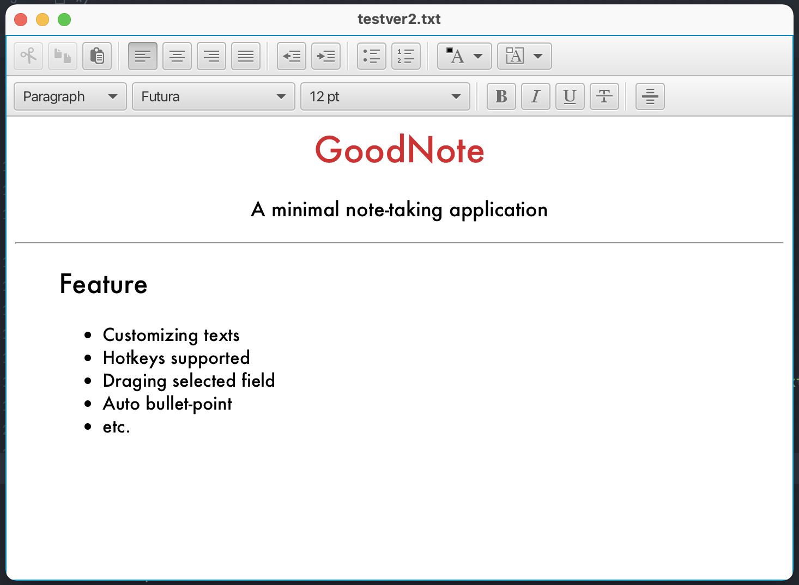

<h1 align="center">
   
  </a>
   
  GoodNote
   
</h1>

<h4 align="center">A minimal note-taking application built on top of <a href="https://kotlinlang.org/" target="_blank">Kotlin</a></h4>

  <a href="#goal">Goal</a> •
  <a href="#features">Key Features</a> •
  <a href="#installation">Installation</a> •
  <a href="#technologies">Technologies</a> •
  <a href="#contribution">Contribution</a> •
  <a href="#releases">Releases</a> •
  <a href="#license">License</a>

## Goal
**GoodNote** is a simple and easy-to-use note-taking application with many features supported. This is a project from team 112 of CS 346: Application development.

## Features
#### Main features include:
- A top-level menu bar that lists major functions, and indicates the hotkeys for each feature (e.g. File, Edit, View menu and submenus).
- Toolbars that let the user control settings and modes that apply to the application e.g. a Bold button that can be used to embolden text, and reflects the state of selected text.
- Window resizing, so that the user can resize and reposition the application. You should save the window size and position on exit, and restore that size and position when they relaunch it.
- Minimize/mazimize buttons function as expected.
- Undo-redo support for actions in the user interface.
- Cut-copy-paste text.

#### Additional features:
- Create, edit, delete a note (using both keyboard and point-click).
- Group related notes together e.g. folders or tags. Support add/delete and rename groups, and move notes between groups.
- Support for bulleted lists, including the ability to apply or remove bullets from a block of selected text.

## Installation

## Technologies

This project uses the following technologies:

- [Kotlin](https://kotlinlang.org/) as the main language.
- [GitLab](https://about.gitlab.com/) for project tracking.
- [JavaFX](https://openjfx.io/) for the graphical user-interface.
- [SQLite](https://www.sqlite.org/index.html) for managing local storage.
- [H2](https://www.h2database.com/html/main.html) for remote data storage.
- [JUnit](https://junit.org/junit5/) for testing.
- [Gradle](https://gradle.org/) for project builds.

## Contribution

- [Abhay Menon](https://git.uwaterloo.ca/a32menon): @a32menon
- [Inseo Kim](https://git.uwaterloo.ca/i32kim): @i32kim
- [Hoang Dang](https://git.uwaterloo.ca/h22dang): @h22dang
- [Guransh Khurana](https://git.uwaterloo.ca/g3khuran): @g3khuran
- [Anshul Ruhil](https://git.uwaterloo.ca/aruhil): @aruhil

## Releases

> V**ersion 1.0.0**: Infrastructure & GUI (released Feb 17, 2023)
> * [release-notes (md)](releases/v1.0.0-release-notes.md)
> * installer (Window, MacOS)

>**Version 2.0.0**: Data Persistance (released Mar 10, 2023)
> * release-notes (md)
> * installer (Window, MacOS)

## License

---
